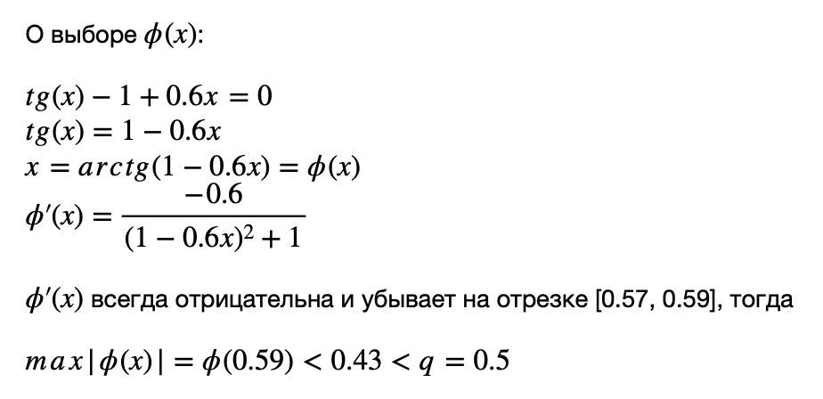

# Савельев Матвей, КН-402

### Функция:
```
f(x) = tg(x) - 1 + 0.6x
```

### Первая производная
```
f'(x) = (1 / cos(x)^2) + 0.6
```
### Вторая производная
```
f''(x) = 2sin(x) / cos(x)^3
```


### Содержание:
[Метод полловинного деления](#метод-половинного-деления) \
[Метод Ньютона](#метод-ньютона) \
[Модифицированный метод Ньютона](#модифицированный-метод-Ньютона) \
[Метод неподвижных хорд](#метод-неподвижных-хорд) \
[Метод подвижных хорд](#метод-подвижных-хорд) \
[Метод простой итерации](#метод-простой-итерации) \
[Сравнение сходимости методов](#сравнение-сходимости-методов)

## Метод половинного деления
#### Для нахождения корня возьмем отрезок [0; 1] 
> Почему? \
> Исходная функция определена и непрерывна (так как дифференцируема) на отрезке [0; 1] \
> При этом ее значения на концах отрезка имеют разные знаки \
> Следовательно существует некоторая точка x на отрезке, где f(x) = 0 \
> Также для любого x из [0; 1] f'(x) > 0, следовательно фунция монотонно возрастает на всем промежутке, а значит корень на данном промежутке единственный
#### Результат
```
Инициализация BinarySearchSolver
================================================================
Проверка критерия: f(a) * f(b) < 0
f(a) * f(b) = -1.157407724654902
================================================================
Вычисление x с точностью 5e-06 займет 18 итераций
Ответ: x = 0.5784358978271484
```

## Метод Ньютона
#### Для нахождения корня возьмем отрезок [0.5; 0.6]
> Почему? \
> Во-первых выполняется условие на разность знаков, \
> Во-вторых гарантируется единственность корня за счет монотонности производной \
> В-третьих оценка погрешности в виде: \
> |x - x_(n+1)| < M / 2m (x - x_n)^2 \
> где M - max(f''(x)) на отрезке, m - min(f'(x)) на отрезке \
> будет сходится к 0 при оценке |x - x0| < b - a
#### В качестве x0 возьмем точку b = 0.6
> Почему? \
> Чтобы выполнялось условие: f(x0) * f''(x0) > 0

#### Результат
```
Инициализация NewtonSolver
----------------------------------------------------------------
Проверка критерия: f(a) * f(b) < 0
f(a) * f(b) = -0.006783717548359928
Проверка критерия: f(x0) * f(x0) > 0
f(x0) * f(x0) = 0.08865693343779141
----------------------------------------------------------------
| dx | < e = 5e-06. Остановка.
Ответ: x = 0.5784374830559201
Количество итераций для вычисления: 3
```

## Модифицированный метод Ньютона
> Здесь отрезок и x0 такие же, как и в обычном методе Ньютона, так как критерии не меняются

#### Модификацией является расчет x_(n+1):
> В обычном Ньютоне: \
> x_(n+1) = x_n - f(x_n) / f'(**x_n**) \
> В модифицированном: \
> x_(n+1) = x_n - f(x_n) / f'(**x_0**) \

#### Результат
```
Инициализация ModifiedNewtonSolver
Инициализация NewtonSolver
----------------------------------------------------------------
Проверка критерия: f(a) * f(b) < 0
f(a) * f(b) = -0.006783717548359928
Проверка критерия: f(x0) * f(x0) > 0
f(x0) * f(x0) = 0.08865693343779141
----------------------------------------------------------------
| dx | < e = 5e-06. Остановка.
Ответ: x = 0.578437572209433
Количество итераций для вычисления: 3
```

## Метод неподвижных хорд
> Выбор отрезка остается таким же [0.5; 0.6]

#### В качестве x0 и x1 выбираем концы отрезков

#### Критерий остановки:
> | x - x_n | < | f(x_n) / m | < e

#### Результат:
```
Инициализация FixedChordSolver
----------------------------------------------------------------
Проверка критерия: f(a) * f(b) < 0
f(a) * f(b) = -0.006783717548359928
----------------------------------------------------------------
| dx | < e = 5e-06. Остановка.
Ответ: x = 0.5784374074238802
Количество итераций для вычисления: 3
```

## Метод подвижных хорд
> Все то же самое,  что и в предыдущем методе,
> но в расчете x_(n+1) участвует x_(n-1) вместо x0

#### Результат
```
Инициализация MovingChordSolver
Инициализация FixedChordSolver
----------------------------------------------------------------
Проверка критерия: f(a) * f(b) < 0
f(a) * f(b) = -0.006783717548359928
----------------------------------------------------------------
| dx | < e = 5e-06. Остановка.
Ответ: x = 0.5784374743065721
Количество итераций для вычисления: 3
```

## Метод простой итерации



#### Сужаем отрезок до [0.57; 0.59]
> Это позволяет нам оценить max|phi(x)| <= q = 1 / 2 \
> При этом будет выполнятся критерий центра отрезка

#### Результат
```
Инициализация SimpleIterationSolver
Проверка критерия: f(a) * f(b) < 0
f(a) * f(b) = -0.00040118676122923805
Проверка критерия: | phi(mid) - mid | <= (1 - q) * r
----------------------------------------------------------------
| dx | < e = 5e-06. Остановка.
Ответ: x = 0.5784373689762675
Количество итераций для вычисления: 11
```

## Сравнение сходимости методов

#### Результат:

| Метод      | Итераций | 
| ----------- | ----------- |
| Половинное деление      | 18       |
| Простой итерации   | 11        |
|Ньютона|3|
|Модифицированный Ньютона|3|
|Неподвижных хорд|3|
|Подвижных хорд|3|

Самый худший - **метод половинного деления**, потому что область поиска всегда сужается ровно в 2 раза. 

Следующий - **простой итерации**, по факту вел себя так же, как и половинное деление, потому что все условия выполнялись при оценке q = 1/2, что эквивалентно сужению от простой итерации. Выйгрыш был получен исключительно за счет меньшего стартового отрезка для поиска.

Оставшиеся методы на данном примере показали одинаковый результат.
